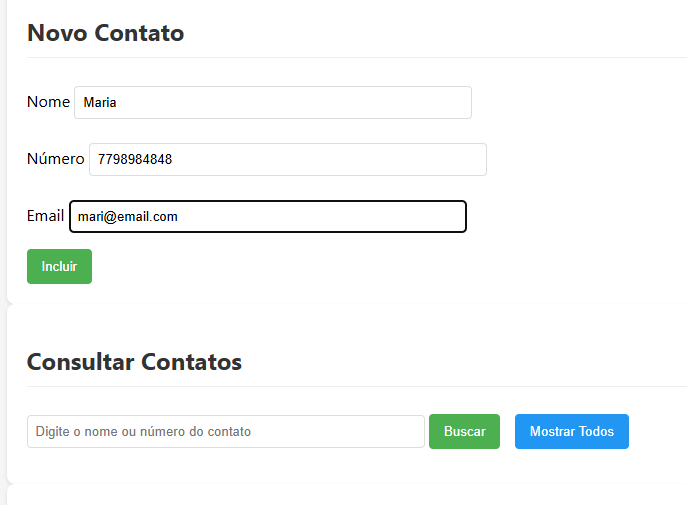
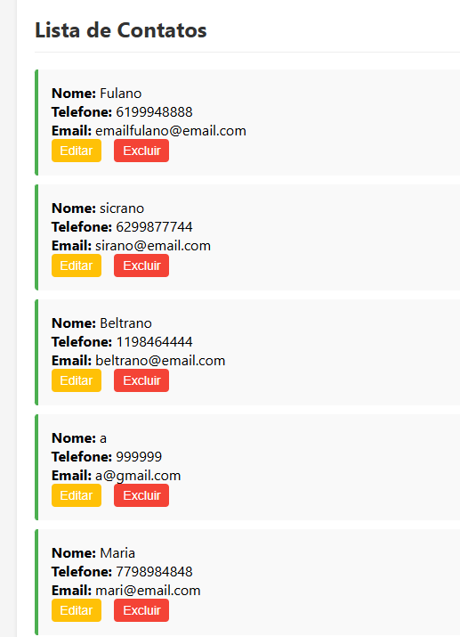
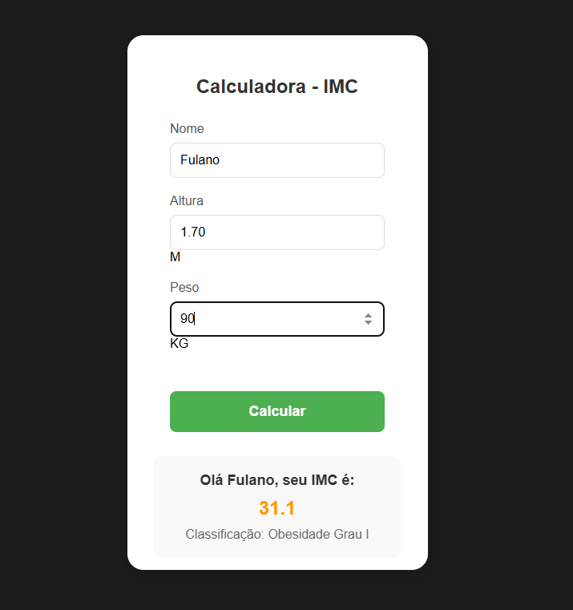
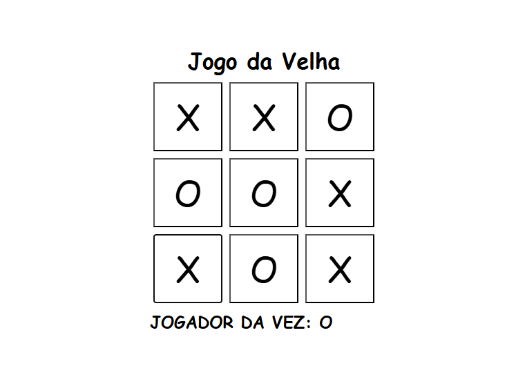
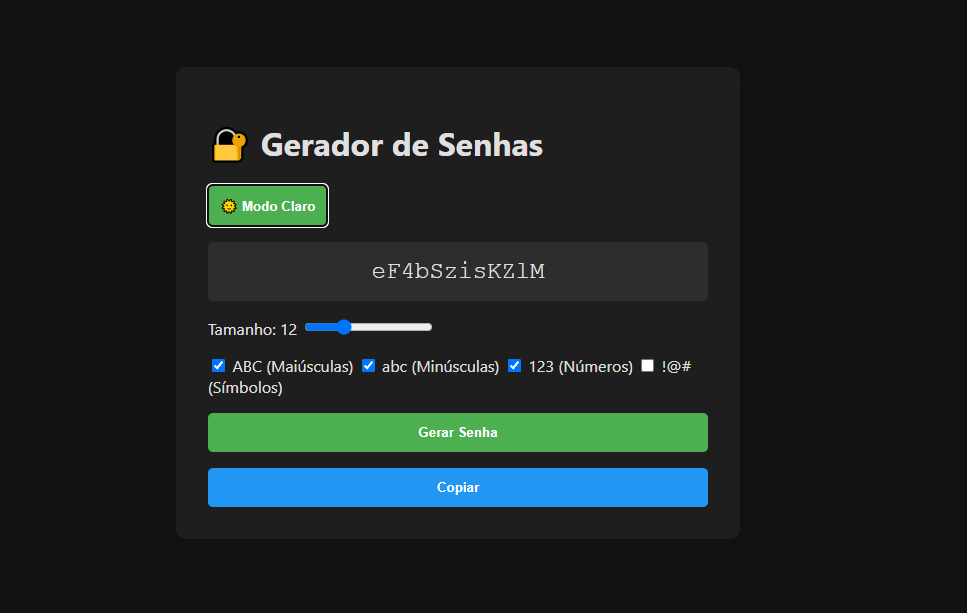
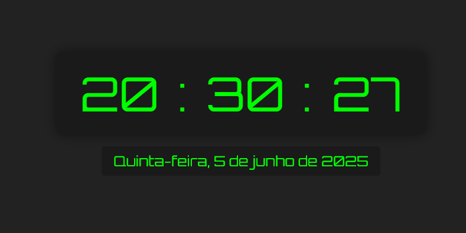
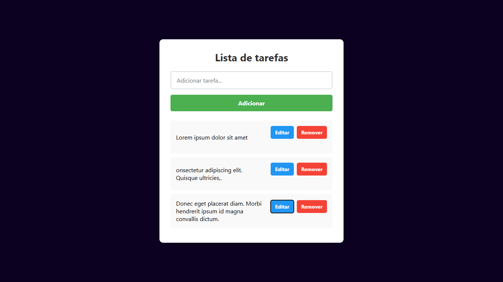

📚 Mini Projetos em JavaScript
Bem-vindo ao meu repositório de mini projetos em JavaScript! Esta coleção demonstra meus aprendizados e habilidades em desenvolvimento web front-end.

🚀 Projetos Incluídos
1. 📅 Agenda de Contatos   
Aplicação CRUD completa para gerenciar contatos pessoais com:
Armazenamento local no navegador
Busca por nome ou telefone
Validação de campos
Tecnologias: HTML5, CSS3, JavaScript (LocalStorage)

3. ⚖️ Calculadora IMC
Calculadora de Índice de Massa Corporal com:
Classificação automática conforme padrões da OMS
Interface responsiva
Feedback visual colorido
Tecnologias: HTML5, CSS3, JavaScript

5. ⭕❌ Jogo da Velha
Jogo clássico com:
Modo multiplayer local
Interface intuitiva
Animações de vitória
Tecnologias: HTML5, CSS3, JavaScript

4. 🔐 Gerador de Senhas
Ferramenta para criar senhas seguras com:
Personalização de comprimento
Tipos de caracteres (maiúsculas, minúsculas, números, símbolos)
Botão de copiar para área de transferência
Tecnologias: HTML5, CSS3, JavaScript

6. ⏰ Relógio Digital
Relógio em tempo real com:
Formato 12h/24h
Data completa
Design minimalista
Tecnologias: HTML5, CSS3, JavaScript (Date API)

8. ✅ Lista de Tarefas

Gerenciador de tarefas com:
CRUD completo
Persistência no LocalStorage
Filtros de visualização
Tecnologias: HTML5, CSS3, JavaScript

🛠 Como Executar
Clone o repositório:

bash
git clone https://github.com/MauroSergio61/MiniProjetosJavascript.git
Acesse a pasta do projeto desejado:

bash
cd MiniProjetosJavascript/NomeDoProjeto
Abra o arquivo index.html no navegador

🌟 Habilidades Demonstradas
Manipulação do DOM
Armazenamento local (LocalStorage)
Event Listeners
Validação de formulários
Responsividade
Lógica de programação

🤝 Como Contribuir
Contribuições são bem-vindas! Siga estes passos:
Faça um fork do projeto
Crie uma branch (git checkout -b feature/nova-feature)
Commit suas mudanças (git commit -m 'Adiciona nova feature')
Push para a branch (git push origin feature/nova-feature)
Abra um Pull Request

📧 Contato
Mauro Sérgio - maurosergio1998@gmail.com

⭐️ Deixe uma estrela se gostou do repositório!
